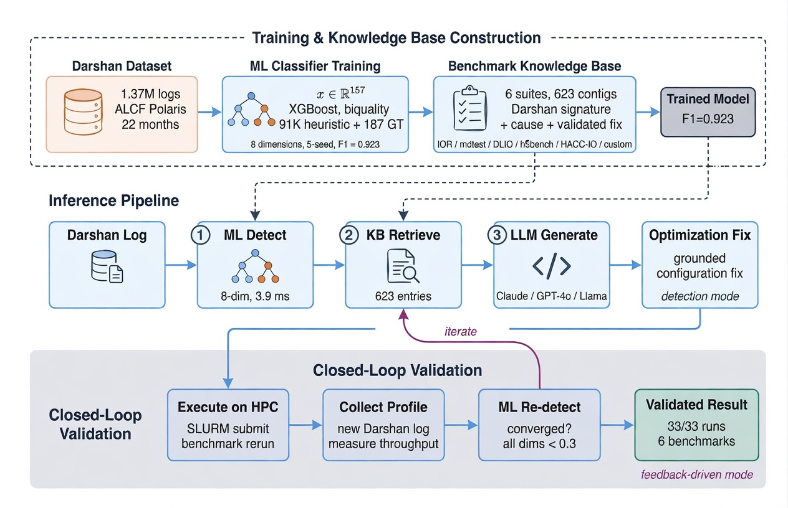
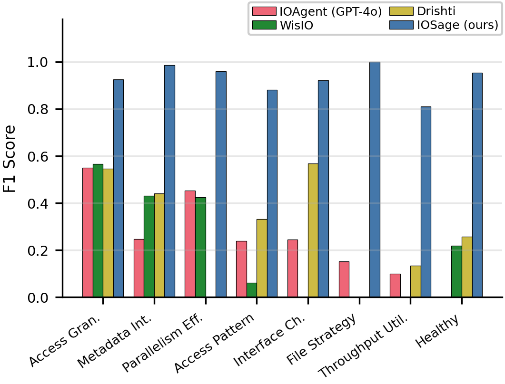
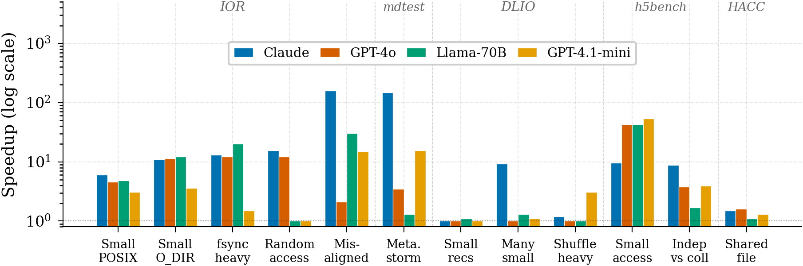

# IOSage

**Benchmark-Grounded Multi-Label I/O Bottleneck Diagnosis with Validated Recommendations**

Submitted to SC 2026 (Track: Performance Measurement, Modeling, and Tools).

## Architecture



IOSage detects I/O bottlenecks in HPC applications from Darshan profiling logs and generates code-level optimization recommendations. It combines a multi-label XGBoost classifier with LLM-generated fixes grounded in a benchmark-verified knowledge base (DIOBench, 689 entries from six benchmark suites). The classifier acts as a precision gate: only detected bottleneck dimensions are forwarded to the LLM, reducing false positives by 94% compared to LLM-only diagnosis.

## Main Results

| Metric | Value |
|--------|-------|
| ML detection (Micro-F1, 5 seeds) | 0.929 +/- 0.003 |
| vs. Drishti / WisIO / IOAgent | 2.6x / 2.9x / 2.8x higher |
| False-positive reduction (TraceBench) | 94% (33 to 2) |
| Closed-loop speedup (4 LLMs, geomean) | 4.5x to 11.4x |
| TraceBench real-app precision | 0.857 |
| Detection latency (median) | 43 ms |
| LLM latency (per trace) | 4 to 18 s |

### Per-Dimension Detection (F1)



### Iterative Closed-Loop Speedups (4 LLMs)



## Getting Started

### Prerequisites

- Python 3.9, 16+ CPU cores, 16 GB RAM. No GPU required.
- Conda (recommended) or pip.

### Installation (15 min)

```bash
git clone https://github.com/BanisharifM/IOSage.git
cd IOSage
conda env create -f environment.yml
conda activate sc2026

# Verify installation
python -c "import xgboost, lightgbm, shap, cleanlab; print('OK')"
```

The smoke test should print `OK`.

### Quick Reproduction (20 min)

Uses pre-processed features and cached LLM outputs. Single seed, no API key needed.

```bash
bash scripts/reproduce_all.sh --quick
```

### Full Reproduction (65 min on 16 cores)

Runs all 5 seeds, all 4 model families, SHAP analysis, and figure generation.

```bash
bash scripts/reproduce_all.sh
```

## Reproducing Paper Results

Each paper table and figure maps to a specific script step:

| Paper Element | Script | Expected Output |
|---------------|--------|-----------------|
| Table II (baselines) | `--step 6` | `results/.../final_metrics.json` |
| Table III (ML ablation) | `--step 6` | XGBoost Mi-F1 in [0.910, 0.948] |
| Table IV (per-label) | `--step 6` | Per-dimension F1 scores |
| Table V (recommendation ablation) | `--step 8` | Groundedness and Rec.P metrics |
| Tables VI-VII (closed-loop) | `--step 8` | Speedup ratios per workload |
| Figure 3 (per-dim F1 bars) | `--step 9` | `paper/figures/fig_gt_vs_heuristic.pdf` |
| Figure 4 (SHAP importance) | `--step 7` | `paper/figures/shap/fig_shap_global_bar.pdf` |
| Figure 5 (iterative speedups) | `--step 9` | `paper/figures/fig_iterative_speedup_comparison.pdf` |

Figure 1 (architecture diagram) was created manually and is included as a static PDF.

## Project Structure

```
IOSage/
├── src/
│   ├── data/               # Darshan parsing, feature extraction, preprocessing
│   ├── models/             # ML training (biquality), SHAP attribution
│   ├── llm/                # LLM recommendation, KB retrieval, iterative optimizer
│   └── ioprescriber/       # End-to-end pipeline (detect, retrieve, recommend)
├── configs/                # Training and preprocessing hyperparameters (YAML)
├── scripts/                # Reproduction, figure generation, verification
├── benchmarks/             # Ground-truth generation (IOR, mdtest, DLIO, h5bench, HACC-IO, custom)
├── data/
│   ├── knowledge_base/     # 689-entry benchmark-verified KB (JSON)
│   └── llm_cache/          # Cached LLM outputs for offline reproduction
├── models/                 # Trained model weights
└── results/                # Evaluation metrics and experiment outputs
```

## Dataset

**Production corpus:** 1,397,216 anonymized Darshan logs from ALCF Polaris (Apr 2024 to Feb 2026).

DOI: [10.5281/zenodo.15052603](https://doi.org/10.5281/zenodo.15052603)

| Processing Stage | Rows | Features |
|------------------|------|----------|
| Raw extraction | 1,397,216 | 186 |
| After cleaning | 131,151 | 186 |
| ML-ready (after exclusion) | 131,151 | 157 |
| Train / Val / Test (temporal) | 91,807 / 19,672 / 19,672 | 157 |

**DIOBench (benchmark ground truth):** 689 verified samples from 6 benchmark suites (IOR, mdtest, DLIO, h5bench, HACC-IO, custom mpi4py), split into 201 development and 488 test via iterative stratification.

## Claims Supported by This Artifact

| # | Claim | Supported | How to Verify |
|---|-------|-----------|---------------|
| 1 | 0.929 Micro-F1 on 488-sample DIOBench test set | Yes | `--step 6`, check `final_metrics.json` |
| 2 | Outperforms Drishti (0.364), WisIO (0.320), IOAgent (0.331) | Yes | `--step 6`, baselines in same JSON |
| 3 | 94% FP reduction vs LLM-only (33 to 2) | Yes | `--step 8`, TraceBench evaluation |
| 4 | Groundedness 0.83 to 0.95 across 4 LLMs | Yes | `--step 8`, cached LLM outputs |
| 5 | 4.5x to 11.4x closed-loop speedups | Yes | Pre-computed iterative results in `results/` |
| 6 | 43 ms median detection latency | Yes | `results/.../latency_breakdown.json` |

**Not directly reproducible without HPC access:** benchmark execution (requires Lustre + SLURM) and live LLM inference (requires OpenRouter API key). Pre-computed results are provided for both.

## Software Dependencies

| Package | Version | Purpose |
|---------|---------|---------|
| Python | 3.9 | Runtime |
| XGBoost | 2.1.4 | ML classifier (primary) |
| LightGBM | 4.5.0 | ML classifier (baseline) |
| scikit-learn | 1.6.1 | Metrics, Random Forest, MLP |
| SHAP | 0.49.1 | Offline feature attribution |
| Cleanlab | 2.7.1 | Label noise detection |
| pandas | 2.3.3 | Data processing |
| NumPy | 1.26.4 | Numerical computing |
| PyDarshan | 3.5.0 | Darshan log parsing |
| openai | 1.55+ | OpenRouter API client (optional) |

All versions pinned in `environment.yml` and `requirements.txt`.

## ALCF Polaris System

| Component | Specification |
|-----------|---------------|
| Nodes | 520 HPE Apollo 6500 Gen 10+ |
| CPU | AMD EPYC Milan 7543P (32-core) |
| GPU | 4x NVIDIA A100 per node |
| Storage | Eagle/Grand Lustre (160 OSTs, 100 PiB, 650 GiB/s) |

## License

To be determined upon acceptance.
